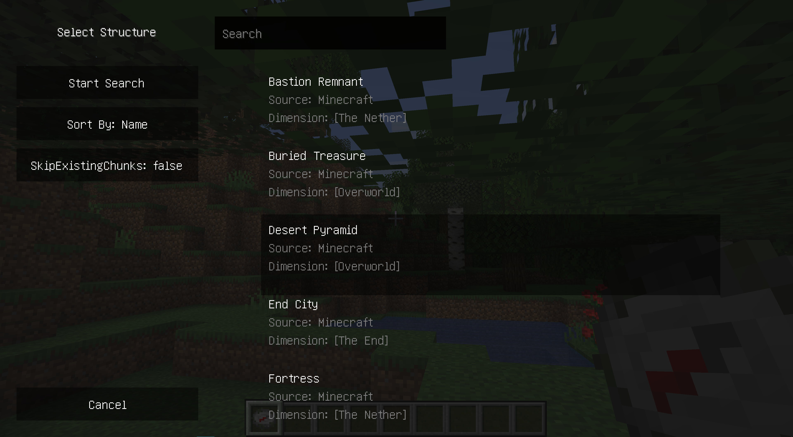
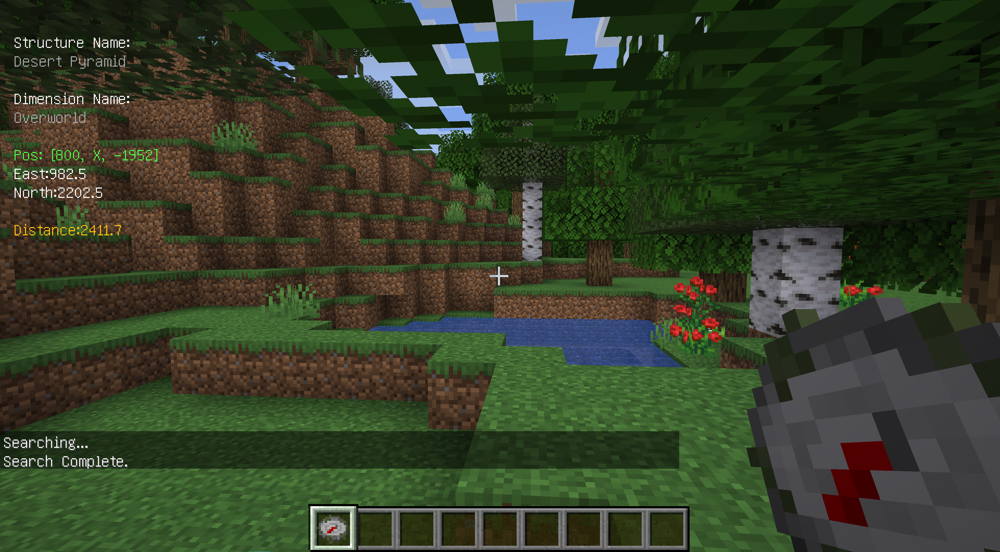
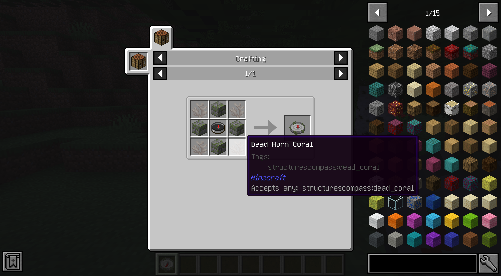

# Structures' Compass

[](https://www.curseforge.com/minecraft/mc-mods/structures-compass)
[](https://minecraft.fandom.com/wiki/Java_Edition_1.16.5)
[](https://github.com/Samarium150/StructuresCompass/blob/master/LICENSE)
[](https://github.com/Samarium150/StructuresCompass/actions/workflows/Gradle%20CI.yml)

[简体中文](docs/README-zh.md)

Structures' Compass a Minecraft Forge mod allows player to quickly locate a specific [structure](https://minecraft.fandom.com/wiki/Generated_structures).

This mod is inspired by [Nature's Compass](https://github.com/MattCzyr/NaturesCompass), and part of our code is from their mod.

## Features
- Sneak + right click with the Structures' Compass in hand to open the searching GUI.
  - search structure's name directly
  - search structure's source by starting with '@'
  - search structure's available dimensions by starting with '#'
- Right click to search the selected structure again.
- When the compass is not pointing at a structure, or the structure is in another dimension, 
  it will point at random position, just like the normal compass in the Nether or the End. 
- The compass supports all registered structures (vanilla and modded).

## Images


The GUI for searing structures


The HUD for displaying the information of a found structure


## Recipe



4 of any dead coral at 4 corners, 4 of mossy stone bricks at 4 edges and 1 compass at the center

We think the compass is too op, so we increase the crafting difficulty to balance it.

## Further Development

We're too busy to develop, so we just list some possibilities
- [ ] Port to another version like 1.12.2
- [ ] Port to Fabric

## Contribute

Structures and dimensions don't have localized names by default. 
If you see something like `structure.<modid>.<name>` in the GUI or HUD, that essentially means there is not localized name for it.
If you would like to add translations, 
create corresponding JSON files under [`resources/assets/<modid>/lang/`](/src/main/resources/assets) and send Pull Requests to us. 
We've put `zh_cn` translations of structures and dimensions in vanilla Minecraft there as a template, 
and your translations should also follow the same style.
```json
{
  "dimension.minecraft.overworld": "Overworld",
  "structure.minecraft.bastion_remnant": "Bastion Remnant"
}
```

## License

As stated in the introduction, part of our code is from [Nature's Compass](https://github.com/MattCzyr/NaturesCompass), 
which is under [Creative Commons Attribution-NonCommercial-ShareAlike 4.0 International License](https://creativecommons.org/licenses/by-nc-sa/4.0) 
and we've annotated it in the doc string. 
Because CC BY-NC-SA 4.0 is not a software license, we choose [GNU General Public License 3.0](https://www.gnu.org/licenses/gpl-3.0.html) 
for other parts of the code to discourage commercial usage.
