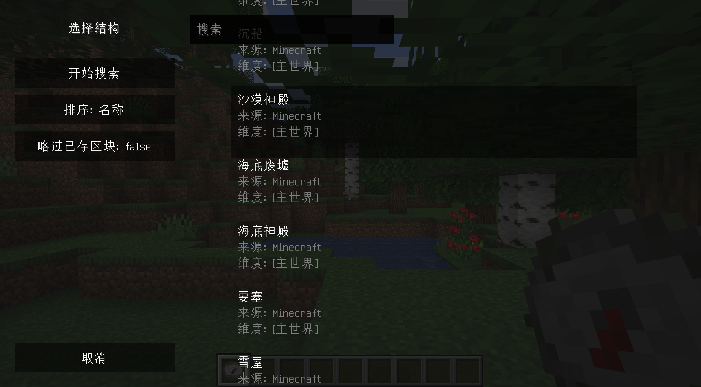
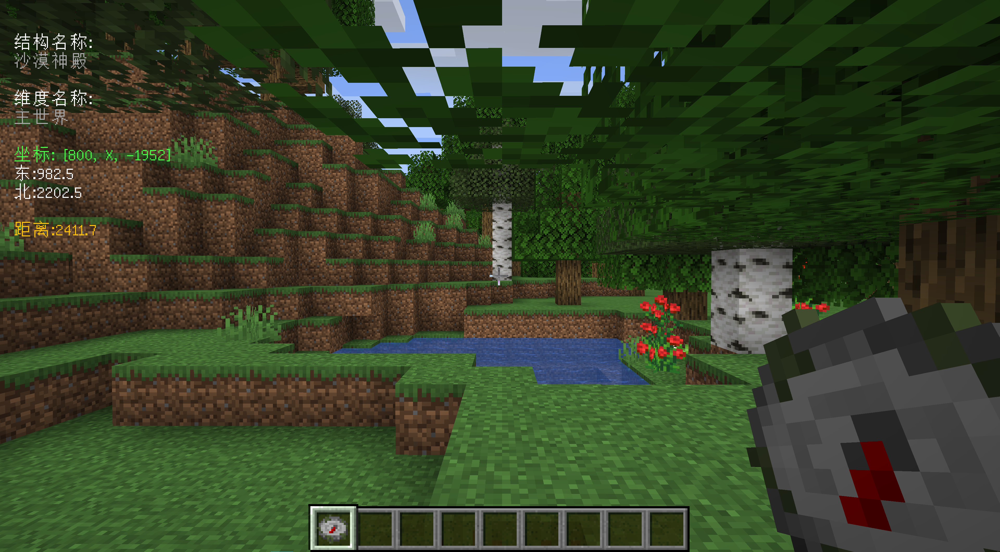
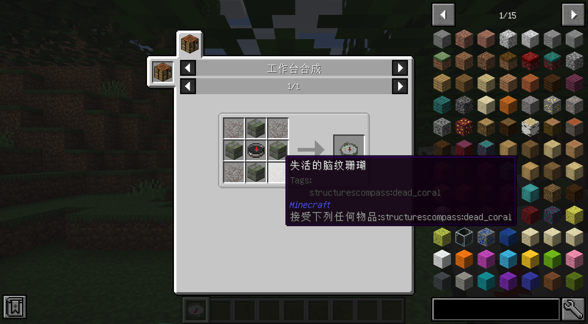

# Structures' Compass

[](https://www.curseforge.com/minecraft/mc-mods/structures-compass)
[](https://minecraft.fandom.com/wiki/Java_Edition_1.16.5)
[](https://github.com/Samarium150/StructuresCompass/blob/master/LICENSE)
[](https://github.com/Samarium150/StructuresCompass/actions/workflows/Gradle%20CI.yml)

结构罗盘是一个能让玩家快速找到某个 [生成结构](https://minecraft.fandom.com/zh/wiki/%E7%94%9F%E6%88%90%E7%BB%93%E6%9E%84) 的Minecraft Forge模组

本模组是受 [自然罗盘](https://github.com/MattCzyr/NaturesCompass/) 的启发而写的，我们代码的一部分也来自这个模组

## 特性
- 潜行 + 右键打开GUI界面来进行搜索
  - 输入结构名称直接搜索
  - 以'@'开头搜索结构的来源
  - 以'#'开头搜索结构可以生成的维度  
- 右键进行重新搜索
- 当罗盘没有找到结构或者结构在不同维度时，指针会随机转动；就像原版指南针在下界或者末地里那样
- 罗盘支持所有注册过的结构（原版的和模组添加的）

## 图片


搜索结构的GUI界面


显示搜索到的结构信息的HUD


## 配方



4个任意失活珊瑚放在4个角，4个苔石砖放在4条边，最后原版指南针放中间

为了平衡罗盘的能力，我们上调了一些制作难度

## 下一步开发

我们都是在摸鱼时间进行的开发，所以这里仅列出可能的下一步
- [ ] 增加对其他版本的支持，比如1.12.2
- [ ] 增加对Fabric的支持

## 贡献

生成结构和维度没有默认的翻译。如果你在GUI或者HUD里看到了类似`structure.<modid>.<name>`的文本，即说明这个结构并没有翻译。
如果你想为本模组添加翻译，可以在 [`resources/assets/<modid>/lang/`](/src/main/resources/assets) 目录下创建对应的JSON文件，
并发送拉取请求（Pull requests）。这里我们已经添加了原版Minecraft里结构和维度的简体中文翻译作为模板，新增的翻译也需要有一样的格式。
```json
{
  "dimension.minecraft.overworld": "主世界",
  "structure.minecraft.bastion_remnant": "堡垒遗迹"
}
```

## 许可证

正如简介中提到的，部分代码来自 [自然罗盘](https://github.com/MattCzyr/NaturesCompass/) ，而这部分代码采用和原模组一样的
[署名-非商业性使用-相同方式共享 4.0 国际](https://creativecommons.org/licenses/by-nc-sa/4.0/deed.zh) 许可证，
文档字符串中已经进行了标注。
因为CC BY-NC-SA 4.0不是软件许可证，所以针对其他部分的代码，这里采用了[GNU通用公共许可证 v3.0](https://www.gnu.org/licenses/gpl-3.0.html)
来反对商业化使用。
